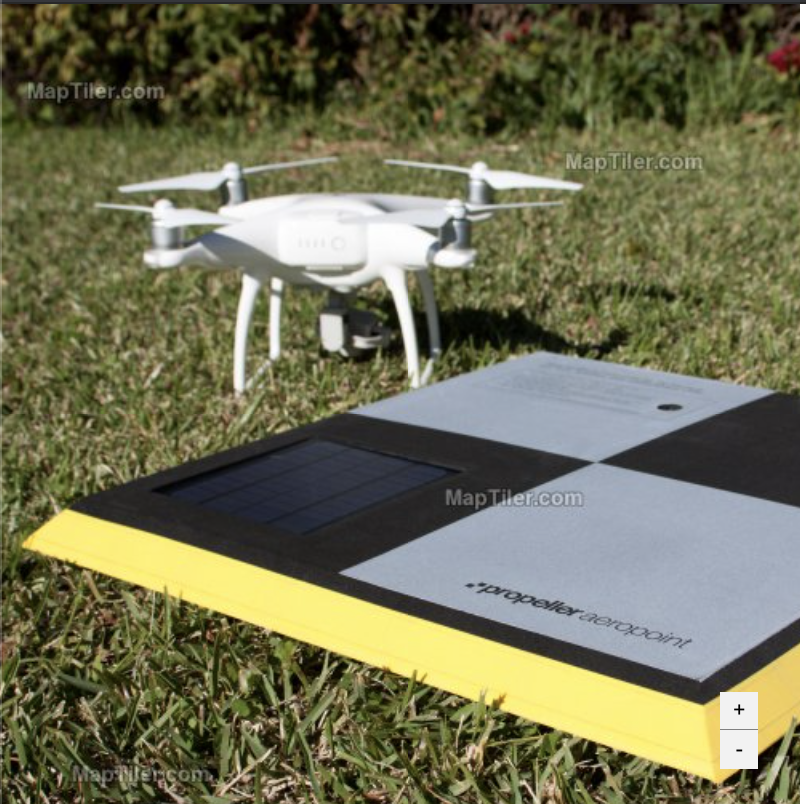

# Propeller Front End Coding Challenge

## Background

Commonly large datasets like maps (2D or 3D) are broken down into chunks with varying levels of detail. You will already be familiar with this concept in e.g. Google Maps, where you can zoom out to see the whole world in low detail. Zoom in and you can see your house. [This blog post](https://macwright.org/2012/05/15/how-web-maps-work.html) provides a good overview.

## The Challenge

We've tiled a high res image into a set of tiles in the 'tiled' folder found in `public/tile-assets` (un-tiled.jpg is just for reference). The task is to create a front-end application that displays the tiles in the style of a 2D map view. We have bootstrapped the application for you (with create-react-app) which provides some basic functionallity such as zooming on scroll and basic panning.

Please avoid using existing mapping frameworks such as Leaflet, Mapbox etc. The app should be self contained and simple for us to build and run (e.g. provide npm install/build/start).

## Tasks

- Fix the bug preventing panning from being in a natural direction
- Allow zooming using +/- buttons.
- Implement zooming that holds the center of the viewport the same. The point on the image at the center of the viewport should be maintained when zooming in and out, just like the functionallity in Google Maps.
- Implement smooth scrolling so instead of snapping between zoom levels provide a gradual transition

## Considerations

- Consider how your app is built.
- Consider coding style (e.g. robustness and maintainability).
- Block in some simple tests.
- Any other extensions you think would demonstrate your ninja coding skills and how you will be an awesome addition to the Propeller team.

That is a long list of things, and we are aware of the fact that your time is limited. Therefore, please let us know some of the tradeoffs that you have made, what you have focussed on and what you have ignored for now.

# Notes from Yvonne
## Changes made
- Printed all image tiles on the screen - originally there were a max of 4x4.

## Tasks
### Fix the bug preventing panning from being in a natural direction
Updated the `onPan()` func so that `setOrigin` updates the origin correctly (should add the movements made, not minus them).

### Allow zooming using +/- buttons.
Added a new `handleZoom` function that takes in whether you'd like to zoom in/out as a param. Added buttons that allow you to zoom in or out.

### Implement zooming that holds the center of the viewport the same.
Got this mostly sorted for the zooming in via buttons as it does not need to take into consideration the position of the mouse. However, when calculating the new origin via mouse scroll, I've had some problems (see more info below). It was working (kinda) for zooming in but was broken for zooming out. I can explain more about this over a call.

To solve this, I made the mouse scroll cause the viewport to zoom into the center, the same way it would on the button press.

### Implement smooth scrolling
I added an animation for this using the `animation` css attribute but there were a number of issues
1. the animation would start and end at a different `scale` size, meaning it popped out a bit at the start to show the animation (e.g. from 120% to 100%).
2. the animation would only play when the `className` was changed. This meant that on two consecutive zoom ins/outs, the second would not play the animation. I tried resetting the class to fix this but there were some issues with resetting the class to empty `''`, then setting it again on the same `event handler`. Setting it twice did not work and meant the render would happen with the previously set animation.

To solve this, I added a css `scale` change on the container `div` that happens on every zoom, rather than using an animation. The trade off is that the viewport is permanently scaled to a different ratio than `100%`.

This was a bit difficult to explain via text so feel free to ask me more questions to clarify.

## Added features
- Updated the cursors:
  - For `buttons`: used `pointer` cursor
  - For indicating that you can `pan`: used `grab` cursor
  - For indicating that you are `panning`: used `grabbing` cursor

## Things I'm unhappy with
- I believe my issue with being unable to centre focus while zooming with the scroll has to do with my lack of understanding of how the origin values scale across the zooming levels. I understand that the `origin` is the value in the `top left` corner, which is used in CSS to control what area of the grid is displayed. However, across levels, the origin values change at a strange ratio (e.g. from 0, to 500, to 1500). This meant that I was unable to zoom using a set formula. I can explain this better over a video call to show my notes and exactly how I was attempting to calculate this.

- I wanted to make a reusable function for zooming in/out that takes in current coordinates - either origin or mouseAt - and zooms in the appropriate amount whether it's been called from a scroll zoom or button zoom. However, as mentioned above, my lack of understanding of the origin meant the two zooming options zoom to the center and use the origin, rather than mouseAt for scroll, to calculate the jump.

- My animations aren't perfect. The component re-render happens the moment before the animation, meaning it snaps then does a nice little zoom. It also looks a bit janky because the origin values across zooming are not 100% correct, so it's not zooming straight into the center. Again, this comes down to me not understanding how the origin scales across levels.

- I've updated the `rowsAndCols` variable to show all tiles in the grid. There is an explanation about this and the impacts on performance in the comments in code. However, after updating this the `viewport` has been flickering images when rendering. I'm not sure why this is happening, and it is not consistent. I am aware of this issue but did not fix it.

- I didn't have time to do tests as I spent so much time trying to fix the above. However, I'm a fan of TDD and do my best to use it as much as possible. To see some examples of other tests I've done, see my repo [here](https://github.com/yvonnevictoria/stocks-code-challenge). You'll find the tests in the same folder of the file they are testing. There are React, Redux, Saga, Container and Node tests for you to see. Please note: as this was a code challenge, I did not test all files.

## A final note
This code challenge was an especially interesting one for me as I've never worked with image processing in this way/maps before. Everything I implemented, I learned as I went along. I'm not necessarily happy with the quality of the code, but this was my first attempt at this type of coding so I'm sure I'll improve as time goes on. Please forgive any rookie errors and I hope this is taken into consideration while looking at the challenge. I'm more than happy to explain any decisions I made over a call.

